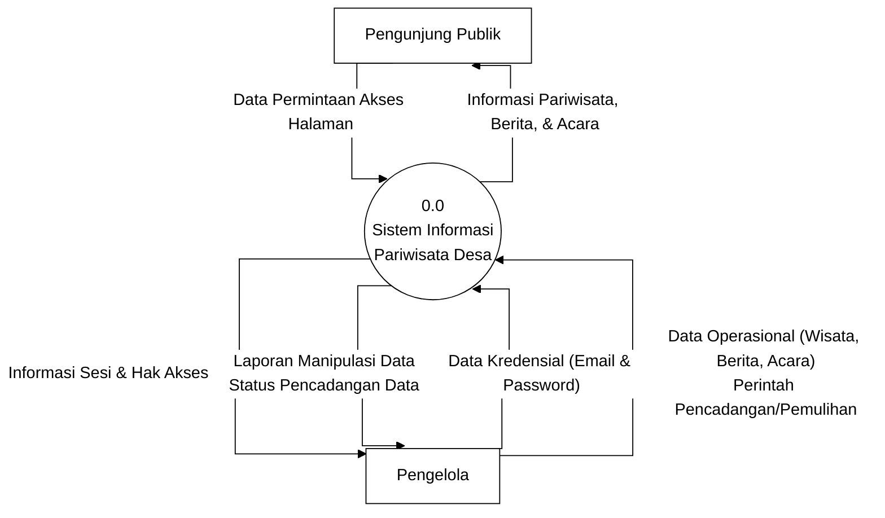
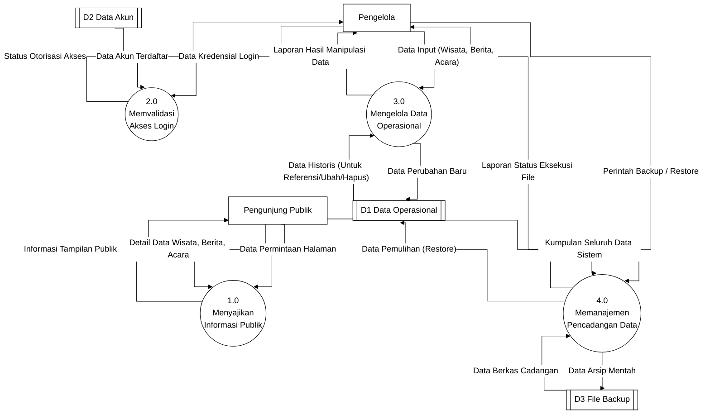
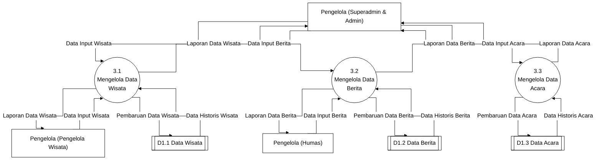

# Data Flow Diagram (DFD) Aplikasi Desa Bugbug

Dokumen ini berisi representasi Data Flow Diagram (DFD) Level 0 (Context Diagram) dan Level 1 yang diturunkan dari alur kerja aplikasi (Flowchart), dan telah disesuaikan dengan **Standar Akademik (Kaidah Yourdon/DeMarco & Gane/Sarson)**:
1. **Nomor Proses**: Menggunakan `0.0` untuk sistem utama, dan `1.0`, `2.0` untuk turunan.
2. **Proses (Kata Kerja)**: Nama proses harus berupa kata kerja (contoh: *Mengelola Data*).
3. **Data Flow (Kata Benda)**: Label panah aliran data harus berupa nama paket data, bukan aktivitas (contoh: *Data Kredensial*, bukan *Input Login*).
4. **Validitas Entitas & Data Store**: Data Store tidak boleh terhubung langsung dengan Entitas atau Data Store lain.

*(Untuk membuka di Draw.io: Salin masing-masing blok kode di bawah ini satu-per-satu, lalu di Draw.io klik **Arrange > Insert > Advanced > Mermaid**, paste kode, lalu klik Insert)*

### 1. DFD Level 0 (Context Diagram)
Menggambarkan batasan sistem (Sistem Informasi Pariwisata Desa) dengan entitas luar (Terminator).

### 2. DFD Level 1
Merinci proses (0.0) menjadi sub-proses operasional berdasarkan fungsi-fungsi sistem, serta melibatkan tempat penyimpanan (Data Store).

### 3. DFD Level 2 (Ledakan Proses 3.0 - Mengelola Data Operasional)
Karena di dalam flowchart terdapat 7 alur spesifik (termasuk alur kerja *Superadmin*, *Admin*, *Humas*, dan *Pengelola Wisata*), maka **Proses 3.0** di Level 1 harus "diledakkan" (di-*breakdown*) menjadi DFD Level 2. Diagram ini menjelaskan secara detail bagaimana setiap *Role* berinteraksi dengan sumber data yang spesifik (Wisata, Berita, Acara).

