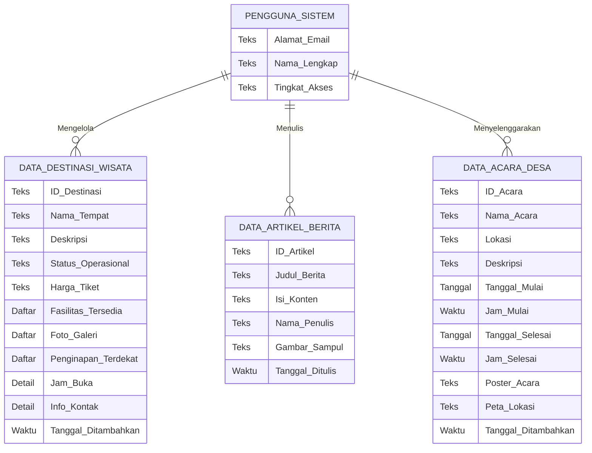

# Diagram Relasi Entitas (ERD) Konseptual

**Catatan Presentasi:** Diagram ini merupakan gambaran konseptual dari entitas data pada sistem (cocok untuk kebutuhan akademik atau presentasi non-teknis). Pada implementasi aslinya, aplikasi ini berjalan tanpa server database eksternal, melainkan menyimpan data langsung di penyimpanan perangkat pengguna (lokal). Semua rincian terkait (seperti fasilitas dan galeri) disimpan menyatu dengan entitas utamanya agar lebih efisien dan sederhana.

