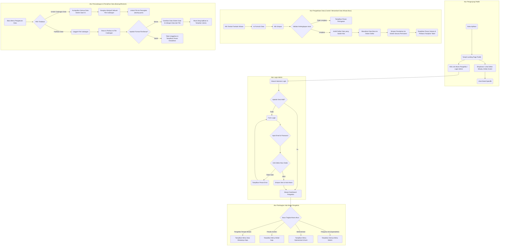

# Flowchart Aplikasi

```mermaid
graph TD
    %% PUBLIC FLOW %%
    subgraph alur_publik ["Alur Pengunjung Publik"]
        P1("Buka Aplikasi") --> P2("Tampil Landing Page Publik")
        P2 --> P3("Eksplorasi: Lihat Daftar Wisata, Artikel, Event")
        P3 --> P5("Lihat Detail Spesifik")
        P2 --> P4("Klik Link Akses Pengelola / Login Admin")
    end

    %% LOGIN FLOW %%
    subgraph alur_login ["Alur Login Admin"]
        P4 --> A("Masuk Halaman Login")
        A --> B{"Apakah Sesi Aktif?"}
        B -- Ya --> C("Masuk Dashboard Pengelola")
        B -- Tidak --> D("Form Login")
        D --> E{"Input Email & Password"}
        E --> F{"Cek Daftar Akun Statis"}
        F -- Valid --> G("Simpan Sesi & Hak Akses")
        G --> C
        F -- Tidak Valid --> H("Tampilkan Pesan Error")
        H --> D
    end

    %% ALUR HAK AKSES PENGGUNA %%
    subgraph alur_hak_akses ["Alur Pembagian Hak Akses Pengelola"]
        C --> I{"Baca Tingkat Akses Akun"}
        I -- Pengurus Inti (Superadmin) --> J["Tampilkan Semua Menu Sistem"]
        I -- Administrator --> K["Tampilkan Menu Operasional Umum"]
        I -- Penulis Konten --> L["Tampilkan Menu Artikel Saja"]
        I -- Pengelola Tempat Wisata --> M["Tampilkan Menu Data Wisatanya Saja"]
    end

    %% ALUR PENGELOLAAN DATA %%
    subgraph alur_pengelolaan ["Alur Pengelolaan Data (Contoh: Menambah Data Wisata Baru)"]
        N("Klik Tombol Tambah Wisata") --> O("Isi Formulir Data")
        O --> P("Klik Simpan")
        P --> Q{"Validasi Kelengkapan Isian"}
        Q -- Tidak Lengkap --> R("Tampilkan Pesan Peringatan")
        Q -- Lengkap --> S("Ambil Daftar Data yang Sudah Ada")
        S --> T("Masukkan Data Baru ke Dalam Daftar")
        T --> U("Simpan Perubahan ke Sistem Secara Permanen")
        U --> V("Tampilkan Pesan Sukses & Perbarui Tampilan Tabel")
    end

    %% ALUR PENCADANGAN DAN PEMULIHAN DATA %%
    subgraph alur_pencadangan ["Alur Pencadangan & Pemulihan Data (Backup/Restore)"]
        W("Buka Menu Pengaturan Data") --> X{"Pilih Tindakan"}
        X -- Unduh Cadangan Data --> Y("Kumpulkan Semua Data Sistem Saat Ini")
        Y --> Z("Bungkus Menjadi Sebuah File Cadangan")
        Z --> AA("Unduh File ke Perangkat (backup.json)")
        X -- Pulihkan Data --> AB("Unggah File Cadangan")
        AB --> AC("Baca & Periksa Isi File Cadangan")
        AC --> AD{"Apakah Format File Benar?"}
        AD -- Benar --> AE("Gantikan Data Sistem Saat Ini dengan Data dari File")
        AE --> AF("Muat Ulang Aplikasi & Tampilan Utama")
        AD -- Salah --> AG("Tolak Unggahan & Tampilkan Pesan Kesalahan")
    end
```
