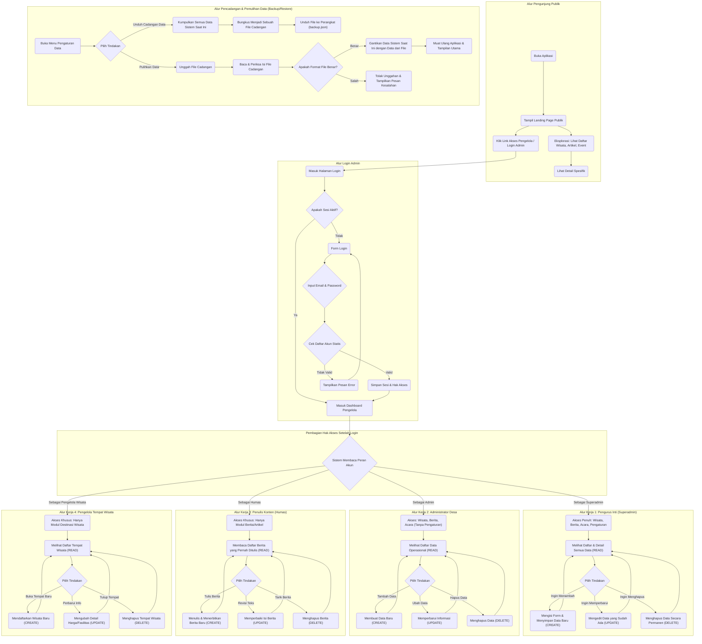

# Flowchart Aplikasi

```mermaid
graph TD
    %% PUBLIC FLOW %%
    subgraph alur_publik ["Alur Pengunjung Publik"]
        P1("Buka Aplikasi") --> P2("Tampil Landing Page Publik")
        P2 --> P3("Eksplorasi: Lihat Daftar Wisata, Artikel, Event")
        P3 --> P5("Lihat Detail Spesifik")
        P2 --> P4("Klik Link Akses Pengelola / Login Admin")
    end

    %% LOGIN FLOW %%
    subgraph alur_login ["Alur Login Admin"]
        P4 --> A("Masuk Halaman Login")
        A --> B{"Apakah Sesi Aktif?"}
        B -- Ya --> C("Masuk Dashboard Pengelola")
        B -- Tidak --> D("Form Login")
        D --> E{"Input Email & Password"}
        E --> F{"Cek Daftar Akun Statis"}
        F -- Valid --> G("Simpan Sesi & Hak Akses")
        G --> C
        F -- Tidak Valid --> H("Tampilkan Pesan Error")
        H --> D
    end

    %% ALUR HAK AKSES PENGGUNA %%
    subgraph alur_hak_akses ["Pembagian Hak Akses Setelah Login"]
        C --> I{"Sistem Membaca Peran Akun"}
    end

    %% 1. ALUR KERJA SUPERADMIN %%
    subgraph alur_superadmin ["Alur Kerja 1: Pengurus Inti (Superadmin)"]
        I -- Sebagai Superadmin --> SA1("Akses Penuh: Wisata, Berita, Acara, Pengaturan")
        SA1 --> SA2("Melihat Daftar & Detail Semua Data (READ)")
        SA2 --> SA3{"Pilih Tindakan"}
        SA3 -- Ingin Menambah --> SA4("Mengisi Form & Menyimpan Data Baru (CREATE)")
        SA4 --> SA2
        SA3 -- Ingin Memperbarui --> SA5("Mengedit Data yang Sudah Ada (UPDATE)")
        SA5 --> SA2
        SA3 -- Ingin Menghapus --> SA6("Menghapus Data Secara Permanen (DELETE)")
        SA6 --> SA2
    end

    %% 2. ALUR KERJA ADMIN DESA %%
    subgraph alur_admin ["Alur Kerja 2: Administrator Desa"]
        I -- Sebagai Admin --> AD1("Akses: Wisata, Berita, Acara (Tanpa Pengaturan)")
        AD1 --> AD2("Melihat Daftar Data Operasional (READ)")
        AD2 --> AD3{"Pilih Tindakan"}
        AD3 -- Tambah Data --> AD4("Membuat Data Baru (CREATE)")
        AD4 --> AD2
        AD3 -- Ubah Data --> AD5("Memperbarui Informasi (UPDATE)")
        AD5 --> AD2
        AD3 -- Hapus Data --> AD6("Menghapus Data (DELETE)")
        AD6 --> AD2
    end

    %% 3. ALUR KERJA HUMAS / PENULIS %%
    subgraph alur_humas ["Alur Kerja 3: Penulis Konten (Humas)"]
        I -- Sebagai Humas --> HM1("Akses Khusus: Hanya Modul Berita/Artikel")
        HM1 --> HM2("Membaca Daftar Berita yang Pernah Ditulis (READ)")
        HM2 --> HM3{"Pilih Tindakan"}
        HM3 -- Tulis Berita --> HM4("Menulis & Menerbitkan Berita Baru (CREATE)")
        HM4 --> HM2
        HM3 -- Revisi Teks --> HM5("Memperbaiki Isi Berita (UPDATE)")
        HM5 --> HM2
        HM3 -- Tarik Berita --> HM6("Menghapus Berita (DELETE)")
        HM6 --> HM2
    end

    %% 4. ALUR KERJA PENGELOLA WISATA %%
    subgraph alur_wisata ["Alur Kerja 4: Pengelola Tempat Wisata"]
        I -- Sebagai Pengelola Wisata --> PW1("Akses Khusus: Hanya Modul Destinasi Wisata")
        PW1 --> PW2("Melihat Daftar Tempat Wisata (READ)")
        PW2 --> PW3{"Pilih Tindakan"}
        PW3 -- Buka Tempat Baru --> PW4("Mendaftarkan Wisata Baru (CREATE)")
        PW4 --> PW2
        PW3 -- Perbarui Info --> PW5("Mengubah Detail Harga/Fasilitas (UPDATE)")
        PW5 --> PW2
        PW3 -- Tutup Tempat --> PW6("Menghapus Tempat Wisata (DELETE)")
        PW6 --> PW2
    end

    %% ALUR PENCADANGAN DAN PEMULIHAN DATA %%
    subgraph alur_pencadangan ["Alur Pencadangan & Pemulihan Data (Backup/Restore)"]
        W("Buka Menu Pengaturan Data") --> X{"Pilih Tindakan"}
        X -- Unduh Cadangan Data --> Y("Kumpulkan Semua Data Sistem Saat Ini")
        Y --> Z("Bungkus Menjadi Sebuah File Cadangan")
        Z --> AA("Unduh File ke Perangkat (backup.json)")
        X -- Pulihkan Data --> AB("Unggah File Cadangan")
        AB --> AC("Baca & Periksa Isi File Cadangan")
        AC --> AD{"Apakah Format File Benar?"}
        AD -- Benar --> AE("Gantikan Data Sistem Saat Ini dengan Data dari File")
        AE --> AF("Muat Ulang Aplikasi & Tampilan Utama")
        AD -- Salah --> AG("Tolak Unggahan & Tampilkan Pesan Kesalahan")
    end
```
