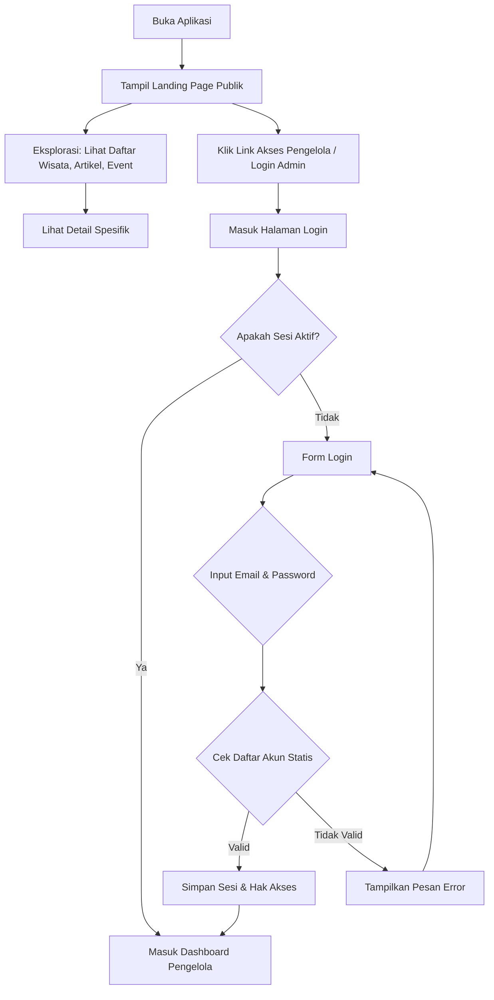
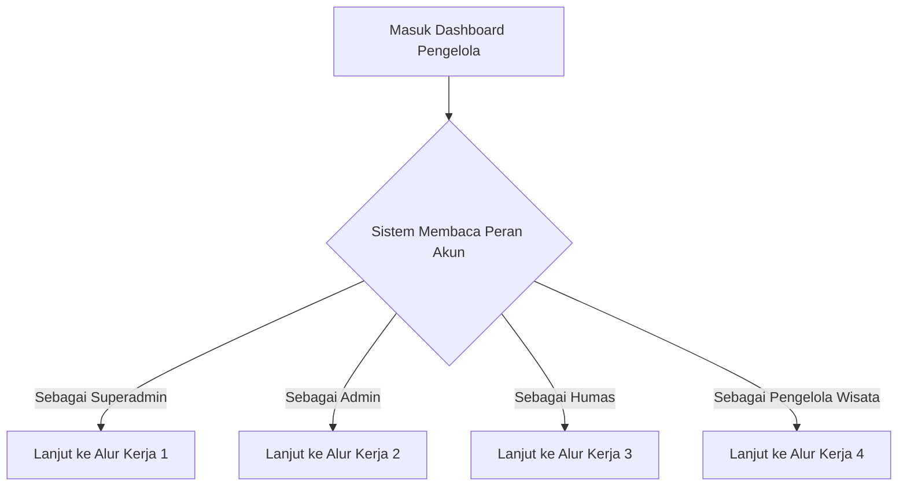
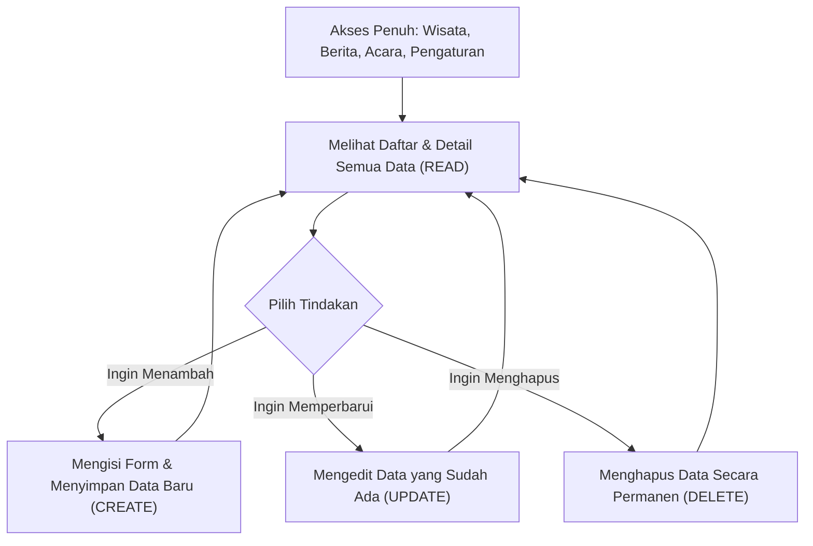
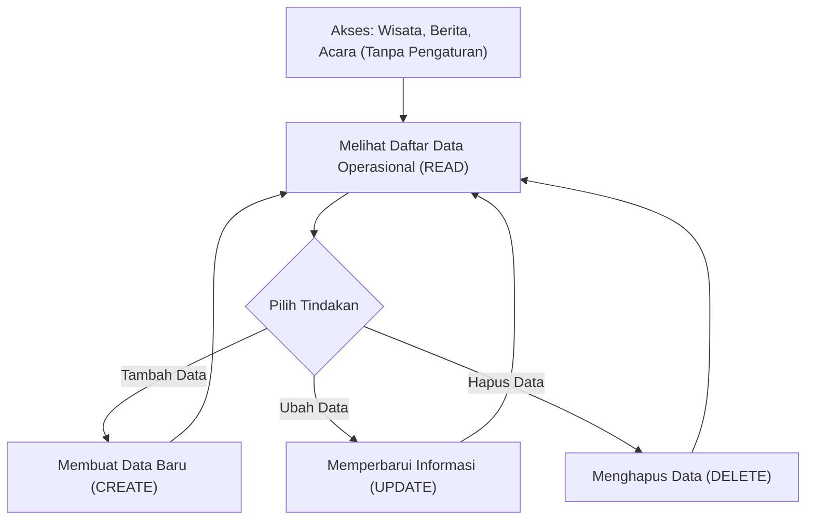
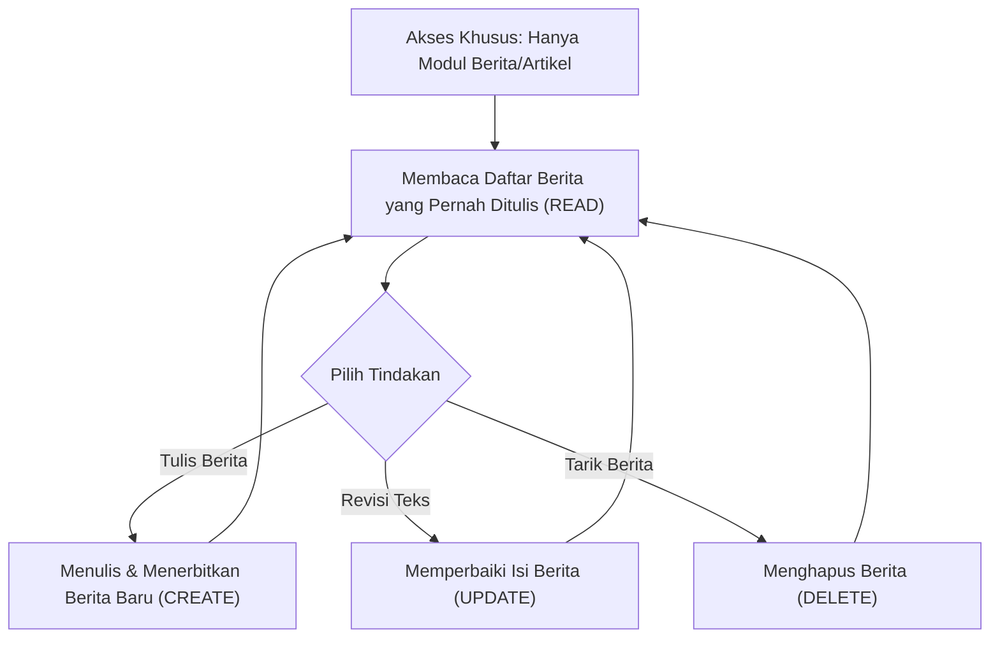
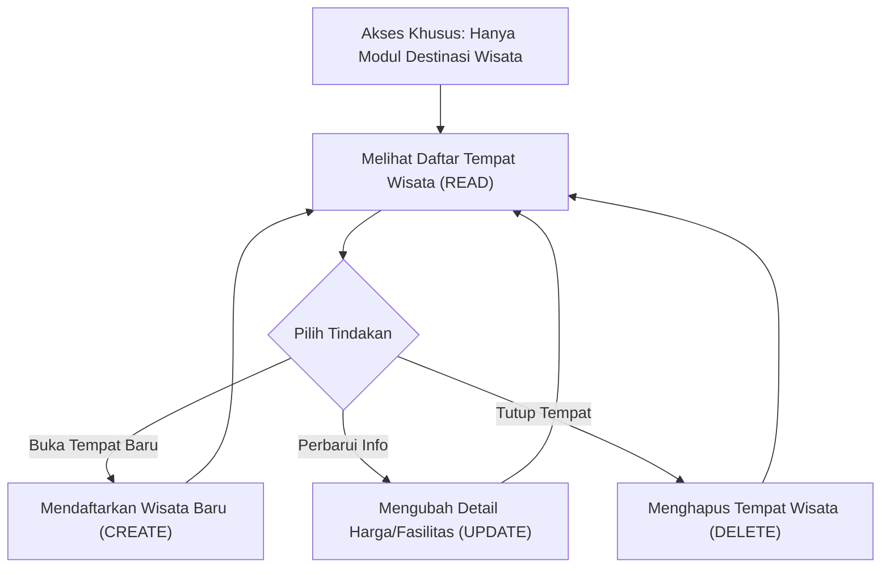
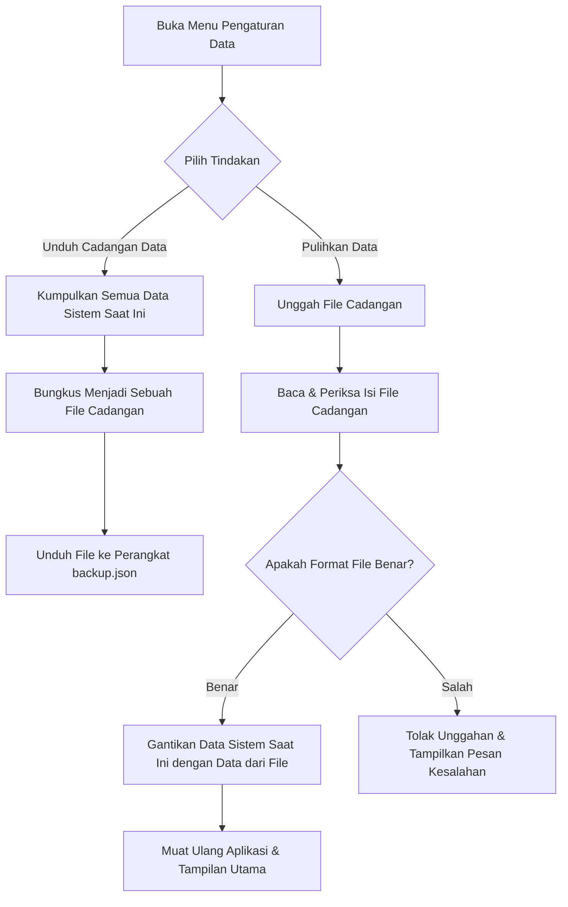

# Flowchart Aplikasi

*(Untuk membuka di Draw.io: Salin masing-masing blok kode di bawah ini satu-per-satu, lalu di Draw.io klik **Arrange > Insert > Advanced > Mermaid**, paste kode, lalu klik Insert)*

### 1. Alur Pengunjung Publik & Login

### 2. Alur Pembagian Hak Akses

### 3. Alur Kerja 1: Superadmin (Pengurus Inti)

### 4. Alur Kerja 2: Administrator Desa

### 5. Alur Kerja 3: Penulis Konten (Humas)

### 6. Alur Kerja 4: Pengelola Tempat Wisata

### 7. Alur Pencadangan & Pemulihan Data

